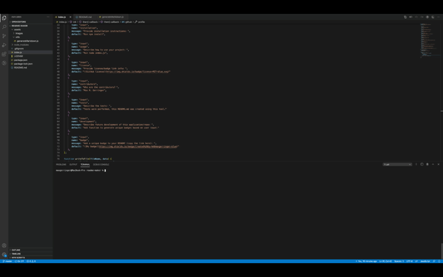

  
  # **README.md Generator**

  

  ## Description

  When creating an open source project on GitHub, it is important to have a quality README with information about the app--what is the app for, how to use the app, how to install it, how to report issues, and how to make contributions so that other developers are more likely to use and contribute to the success of the project. This command-line application allows for quick and easy generation of a project README allowing a project creator to spend more time working on finishing the project and less time creating a good README.

  ## Table of Contents

  - [Repository](#Repository)
  - [Installation](#Installation)
  - [Usage](#Usage)
  - [License](#License)
  - [Contributors](#Contributors)
  - [Tests](#Tests)
  - [Future Development](#Development)
  - [Contact Author](#Contact)
  - [See it in Action](#Demo)

  ## Repository

  - [Project Repo](https://github.com/maxgerringer/readme-maker)

  ## Installation

  Begin by installing the package dependencies:

             npm install

  ## Usage

  Execute the application with this command: 

             node index.js

  ## License

  

  ## Contributors

  Max R. Gerringer

  ## Tests

  Tests were performed, this README.md was created using this tool.

  ## Development

  Add functionality to generate unique badges based on user input.

  ## Contact

  - <max.gerringer@gmail.com>
  - Max R. Gerringer
  - [GitHub Profile](https://github.com/maxgerringer)

  ## Demo

  

